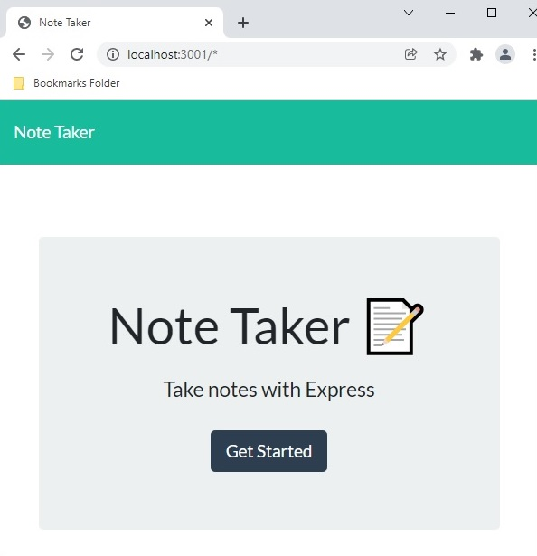
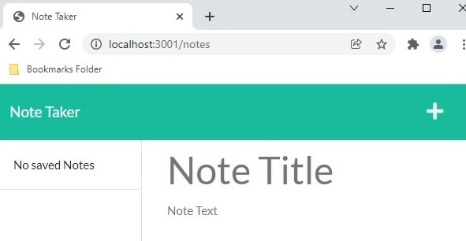
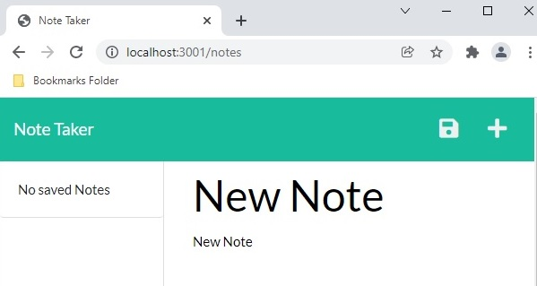
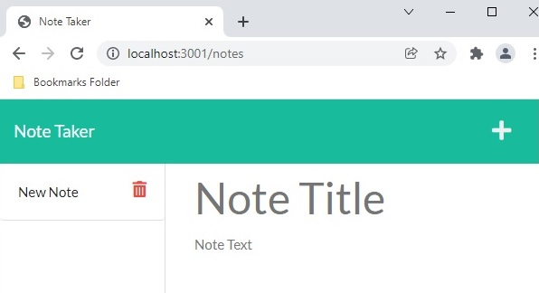
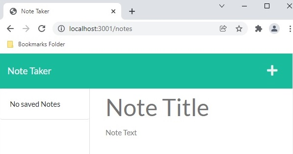
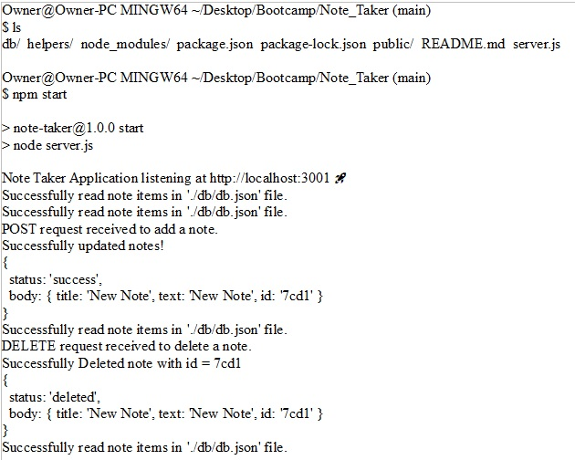

# Note Taker

Node Taker Project for UNH Boot Camp # 11 Express.js assignment. 
This repository was created for the Homework Assignment dealing with Express.js.  

Developer: Duane Cantera 
Date: Dec. 2, 2021 
Assignment: #11 - Express - Note Taker  

This application is used to write and save notes.  The application will use an Express.js back
end and will save and retrieve note data from a JSON file.  The back end of the application will
include a "db.json" file that will be used to store and retrieve notes using the "fs" module.
  
### The Following HTML Routes Are Called: 
"GET /notes" - Returns the "notes.html" file.  
"GET *" - Returns the "index.html" file.  
"GET /api/notes" - Reads the "db.json" file and returns all saved notes as JSON.  
"POST /api/notes" - Receives a new note to save on the request body. Adds it to the "db.json" file, 
                    and then returns the new note to the client.  

### Bonus: 
"DELETE /api/notes/:id" - Receives the query parameter that contains the id of a note to delete.  

### Operations Performed:  

#### "GET *" - Returns the "index.html" file.  

  
#### "GET /notes" - Returns the "notes.html" file.  

  
#### Note Typed In:  

  
#### "POST /api/notes" - Note Added:  

  
#### "DELETE /api/notes/:id" - Note Deleted:  

  
### Terminal Messages Displayed:  

  
### LINKS:

Git Hub Link To Code For Project:  
https://github.com/canterad/Note_Taker.git

Link to deployed application on Heroku: 
https://limitless-sea-65100.herokuapp.com/

